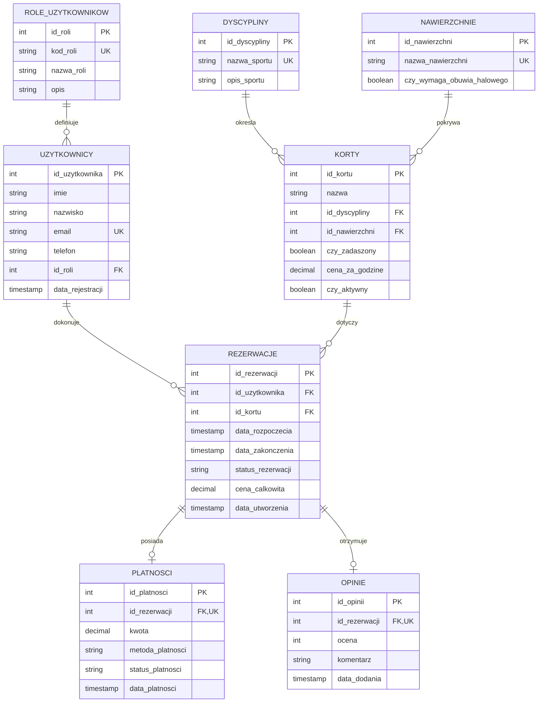

# Projekt Relacyjnej Bazy Danych - System Rezerwacji Kortów Sportowych

**Autorzy:** Zespół projektowy
**System Zarządzania Bazą Danych (SGBD):** PostgreSQL

---

## 1. Wstęp i Cel Projektu

Niniejszy dokument przedstawia projekt relacyjnej bazy danych przeznaczonej do obsługi systemu rezerwacji kortów sportowych. Głównym celem bazy jest bezpieczne i wydajne ewidencjonowanie obiektów sportowych, zarządzanie kontami użytkowników (klientów i personelu), obsługa transakcji płatniczych oraz gromadzenie i przetwarzanie statystyk wykorzystania kortów. 

Projekt realizuje pełny cykl życia bazy danych: od projektowania schematu i normalizacji, przez implementację logiki biznesowej (funkcje, procedury, wyzwalacze), mechanizmy bezpieczeństwa (role, Row-Level Security), transakcyjność i poziomy izolacji, aż po optymalizację wydajnościową (indeksowanie).

---

## 2. Analiza Wymagań i Normalizacja Schematu

Schemat bazy danych został zaprojektowany zgodnie z zasadami **Trzeciej Postaci Normalnej (3NF)**, co gwarantuje spójność danych i brak redundancji:

*   **1NF**: Każda tabela posiada zdefiniowany klucz główny (`id_...`), a wszystkie atrybuty są atomowe (brak pól złożonych).
*   **2NF**: Została spełniona, ponieważ baza nie posiada kluczy głównych złożonych z wielu kolumn, więc nie występuje problem częściowej zależności atrybutów niekluczowych od klucza. Wszystkie kolumny niekluczowe zależą od całego klucza głównego.
*   **3NF**: Żaden atrybut niekluczowy nie jest zależny od innego atrybutu niekluczowego (brak zależności przechodnich). W tym celu wydzielono tabele słownikowe:
    *   `role_uzytkownikow` – zapobiega redundancji opisów ról w tabeli `uzytkownicy`.
    *   `dyscypliny` – eliminuje powtarzanie opisów sportów w rekordach kortów.
    *   `nawierzchnie` – grupuje cechy nawierzchni (np. konieczność obuwia halowego) w osobnym słowniku, eliminując redundancję w tabeli `korty`.

---

## 3. Struktura Techniczna Bazy Danych

Struktura opiera się na 8 powiązanych relacyjnie tabelach, wykorzystujących więzy integralności (Klucze Obce z regułami `ON DELETE CASCADE` oraz `ON DELETE RESTRICT`) oraz ograniczenia typu `CHECK`.

### 3.1. Diagram ERD



---

### 3.2. Wykaz / dokumentacja tabel

System jest zbudowany hierarchicznie:
1.  **Użytkownik** (`uzytkownicy`) ma przypisaną rolę (`role_uzytkownikow`).
2.  **Kort** (`korty`) ma przypisaną dyscyplinę (`dyscypliny`) oraz nawierzchnię (`nawierzchnie`).
3.  Użytkownicy tworzą **Rezerwacje** (`rezerwacje`) na konkretne korty w określonych przedziałach czasowych.
4.  Każda rezerwacja generuje rekord **Płatności** (`platnosci`).
5.  Zakończona rezerwacja może zostać oceniona poprzez **Opinię** (`opinie`).

#### 1. role_uzytkownikow (Słownik Ról)
Słownik przechowujący role określające uprawnienia użytkowników w systemie.

| Pole | Typ Danych | Atrybuty | Opis ("Po co to jest?") |
| :--- | :--- | :--- | :--- |
| `id_roli` | serial | K. Główny (PK) | Unikalny identyfikator roli (generowany automatycznie). |
| `kod_roli` | varchar(20) | Unikalne, Wymagane | Kod identyfikacyjny roli (np. 'klient', 'pracownik'). |
| `nazwa_roli` | varchar(50) | Wymagane | Pełna nazwa wyświetlana roli. |
| `opis` | text | Opcjonalne | Opis zakresu uprawnień przypisanych do roli. |

#### 2. dyscypliny (Słownik Sportów)
Słownik dyscyplin sportowych, do których przypisywane są korty.

| Pole | Typ Danych | Atrybuty | Opis ("Po co to jest?") |
| :--- | :--- | :--- | :--- |
| `id_dyscypliny` | serial | K. Główny (PK) | Unikalny identyfikator sportu. |
| `nazwa_sportu` | varchar(50) | Unikalne, Wymagane | Nazwa dyscypliny (np. 'tenis', 'squash'). |
| `opis_sportu` | text | Opcjonalne | Krótki opis zasad lub wymagań dyscypliny. |

#### 3. nawierzchnie (Słownik Nawierzchni Boisk)
Słownik określający typ nawierzchni na poszczególnych kortach.

| Pole | Typ Danych | Atrybuty | Opis ("Po co to jest?") |
| :--- | :--- | :--- | :--- |
| `id_nawierzchni` | serial | K. Główny (PK) | Unikalny identyfikator typu nawierzchni. |
| `nazwa_nawierzchni`| varchar(50) | Unikalne, Wymagane | Nazwa nawierzchni (np. 'maczka', 'parkiet'). |
| `czy_wymaga_obuwia_halowego` | boolean | Domyślnie: FALSE | Określa, czy na danej nawierzchni wymagane jest obuwie halowe z jasną podeszwą. |

#### 4. uzytkownicy (Konta Użytkowników)
Tabela przechowująca dane klientów, pracowników oraz administratorów.

| Pole | Typ Danych | Atrybuty | Opis ("Po co to jest?") |
| :--- | :--- | :--- | :--- |
| `id_uzytkownika` | serial | K. Główny (PK) | Unikalny identyfikator użytkownika. |
| `imie` | varchar(50) | Wymagane | Imię użytkownika. |
| `nazwisko` | varchar(50) | Wymagane | Nazwisko użytkownika. |
| `email` | varchar(100) | Unikalne, Wymagane | Adres e-mail stanowiący login w systemie. |
| `telefon` | varchar(20) | Opcjonalne | Telefon kontaktowy. |
| `id_roli` | integer | K. Obcy (FK), Wymagane| Powiązanie z tabelą `role_uzytkownikow`. |
| `data_rejestracji` | timestamp | Domyślnie: TERAZ | Data rejestracji konta w bazie. |

#### 5. korty (Obiekty Sportowe)
Ewidencja kortów i boisk dostępnych do wynajęcia.

| Pole | Typ Danych | Atrybuty | Opis ("Po co to jest?") |
| :--- | :--- | :--- | :--- |
| `id_kortu` | serial | K. Główny (PK) | Unikalny identyfikator obiektu. |
| `nazwa` | varchar(100) | Wymagane | Nazwa własna kortu (np. "Kort Centralny A"). |
| `id_dyscypliny` | integer | K. Obcy (FK), Wymagane| Przeznaczenie sportowe kortu. |
| `id_nawierzchni` | integer | K. Obcy (FK), Wymagane| Rodzaj zastosowanej nawierzchni. |
| `czy_zadaszony` | boolean | Domyślnie: FALSE | Określa czy kort jest kryty (np. hala, balon). |
| `cena_za_godzine` | decimal(10,2)| Wymagane, CHECK >0 | Koszt wynajmu kortu za 1 godzinę. |
| `czy_aktywny` | boolean | Domyślnie: TRUE | Flaga określająca dostępność kortu (np. FALSE przy remoncie). |

#### 6. rezerwacje (Transakcje Rezerwacji)
Główna tabela łącząca użytkowników, obiekty oraz ramy czasowe.

| Pole | Typ Danych | Atrybuty | Opis ("Po co to jest?") |
| :--- | :--- | :--- | :--- |
| `id_rezerwacji` | serial | K. Główny (PK) | Unikalny identyfikator rezerwacji. |
| `id_uzytkownika` | integer | K. Obcy (FK), Wymagane| Klient dokonujący rezerwacji. |
| `id_kortu` | integer | K. Obcy (FK), Wymagane| Rezerwowany obiekt. |
| `data_rozpoczecia` | timestamp | Wymagane | Początek terminu rezerwacji. |
| `data_zakonczenia` | timestamp | Wymagane, CHECK | Koniec terminu rezerwacji (musi być po data_rozp). |
| `status_rezerwacji`| varchar(20) | Domyślnie: 'oczekujaca'| Status (`oczekujaca`, `potwierdzona`, `anulowana`, `zakonczona`). |
| `cena_calkowita` | decimal(10,2)| Domyślnie: 0.00 | Łączny koszt rezerwacji wyliczony na podstawie czasu trwania. |
| `data_utworzenia` | timestamp | Domyślnie: TERAZ | Kiedy złożono wniosek o rezerwację. |

#### 7. platnosci (Rozliczenia Finansowe)
Tabela ewidencjonująca statusy transakcji płatniczych za rezerwacje.

| Pole | Typ Danych | Atrybuty | Opis ("Po co to jest?") |
| :--- | :--- | :--- | :--- |
| `id_platnosci` | serial | K. Główny (PK) | Unikalny identyfikator płatności. |
| `id_rezerwacji` | integer | K. Obcy (FK), Unikalne | Powiązanie z rezerwacją (relacja 1:1). |
| `kwota` | decimal(10,2)| Wymagane, CHECK >=0| Kwota opłacana w transakcji. |
| `metoda_platnosci` | varchar(20) | Wymagane, CHECK | Metoda (`karta`, `przelew`, `gotowka`, `blik`). |
| `status_platnosci` | varchar(20) | Domyślnie: 'oczekujaca'| Status (`oczekujaca`, `zrealizowana`, `odrzucona`, `zwrocona`). |
| `data_platnosci` | timestamp | Opcjonalne | Dokładny moment zatwierdzenia wpłaty. |

#### 8. opinie (System Ocen)
System zbierania opinii od użytkowników po zrealizowanych rezerwacjach.

| Pole | Typ Danych | Atrybuty | Opis ("Po co to jest?") |
| :--- | :--- | :--- | :--- |
| `id_opinii` | serial | K. Główny (PK) | Unikalny identyfikator opinii. |
| `id_rezerwacji` | integer | K. Obcy (FK), Unikalne | Powiązanie z rezerwacją (relacja 1:1). |
| `ocena` | integer | Wymagane, CHECK (1-5)| Ocena jakości obiektu i obsługi w skali 1 do 5. |
| `komentarz` | text | Opcjonalne | Uwagi tekstowe klienta. |
| `data_dodania` | timestamp | Domyślnie: TERAZ | Data wystawienia oceny. |

---

## 4. Zaawansowane Zapytania i Widoki (Views)

W celu uproszczenia warstwy aplikacyjnej oraz ukrycia złożoności zapytań typu `JOIN` przed końcowym użytkownikiem, zaimplementowano dedykowane widoki analityczne:

1.  `v_szczegoly_rezerwacji`: Łączy dane o rezerwacji z danymi klienta, szczegółami kortu, statusem płatności oraz ewentualną opinią.
2.  `v_oblozenie_kortow`: Zlicza sumę godzin zarezerwowanych na danym korcie oraz oblicza średnią ocenę wyciągniętą z opinii klientów.
3.  `v_przychody_miesieczne`: Agreguje wpływy finansowe według roku i miesiąca, dzieląc je na kwoty zrealizowane oraz oczekujące.
4.  `v_statystyki_klientow`: Generuje raport lojalnościowy klientów, sumując ich rezerwacje oraz wydatki w obiekcie.

```sql
-- Widok 1: Szczegóły rezerwacji z kompletem danych powiązanych
CREATE OR REPLACE VIEW v_szczegoly_rezerwacji AS
SELECT 
    r.id_rezerwacji,
    u.id_uzytkownika,
    u.imie || ' ' || u.nazwisko AS klient,
    u.email AS klient_email,
    k.id_kortu,
    k.nazwa AS nazwa_kortu,
    d.nazwa_sportu AS typ_sportu,
    n.nazwa_nawierzchni AS typ_nawierzchni,
    r.data_rozpoczecia,
    r.data_zakonczenia,
    r.data_zakonczenia - r.data_rozpoczecia AS czas_trwania,
    r.status_rezerwacji,
    r.cena_calkowita,
    p.id_platnosci,
    p.metoda_platnosci,
    p.status_platnosci,
    o.ocena AS ocena_klienta,
    o.komentarz AS opinia_klienta
FROM rezerwacje r
JOIN uzytkownicy u ON r.id_uzytkownika = u.id_uzytkownika
JOIN korty k ON r.id_kortu = k.id_kortu
JOIN dyscypliny d ON k.id_dyscypliny = d.id_dyscypliny
JOIN nawierzchnie n ON k.id_nawierzchni = n.id_nawierzchni
LEFT JOIN platnosci p ON r.id_rezerwacji = p.id_rezerwacji
LEFT JOIN opinie o ON r.id_rezerwacji = o.id_rezerwacji;

-- Widok 2: Obłożenie i ocena popularności obiektów
CREATE OR REPLACE VIEW v_oblozenie_kortow AS
SELECT 
    k.id_kortu,
    k.nazwa,
    d.nazwa_sportu AS typ_sportu,
    k.cena_za_godzine,
    COUNT(r.id_rezerwacji) AS liczba_rezerwacji,
    COALESCE(SUM(EXTRACT(EPOCH FROM (r.data_zakonczenia - r.data_rozpoczecia))/3600.0), 0) AS suma_godzin,
    ROUND(AVG(o.ocena), 2) AS srednia_ocena
FROM korty k
JOIN dyscypliny d ON k.id_dyscypliny = d.id_dyscypliny
LEFT JOIN rezerwacje r ON k.id_kortu = r.id_kortu AND r.status_rezerwacji IN ('potwierdzona', 'zakonczona')
LEFT JOIN opinie o ON r.id_rezerwacji = o.id_rezerwacji
GROUP BY k.id_kortu, k.nazwa, d.nazwa_sportu, k.cena_za_godzine;
```

---

## 5. Procedury Składowane i Wyzwalacze (Triggers)

Logika biznesowa została przeniesiona na poziom silnika bazy danych w celu zagwarantowania bezpieczeństwa i automatyzacji operacji.

### 5.1. Funkcje i Procedury Składowane

*   `fn_sprawdz_dostepnosc_kortu(id_kortu, data_rozp, data_zak)`: Sprawdza, czy w podanych godzinach wybrany kort nie posiada innych aktywnych rezerwacji.
*   `proc_zloz_rezerwacje(id_uzytkownika, id_kortu, data_rozp, data_zak, ...)`: Procedura tworząca rezerwację. Automatycznie weryfikuje dostępność, wylicza koszt końcowy za pomocą `fn_oblicz_cene_rezerwacji` i zakłada oczekujący rekord płatności.

### 5.2. Wyzwalacze (Triggers)

*   `trg_rezerwacje_terminy`: Wyzwalacz typu `BEFORE INSERT OR UPDATE` uruchamiany na tabeli `rezerwacje`. Zabezpiecza bazę danych przed próbą bezpośredniego zapisania nakładających się terminów, zgłaszając wyjątek i wycofując transakcję.
*   `trg_platnosci_rezerwacje`: Wyzwalacz typu `AFTER UPDATE` na tabeli `platnosci`. Automatyzuje przepływ statusów rezerwacji: jeśli status płatności zmienia się na 'zrealizowana', rezerwacja otrzymuje status 'potwierdzona'. W przypadku odrzucenia płatności, rezerwacja zostaje automatycznie anulowana.

```sql
-- Kod wyzwalacza zabezpieczającego przed kolizją terminów rezerwacji
CREATE OR REPLACE FUNCTION trg_fn_sprawdz_nakladanie_terminow()
RETURNS TRIGGER AS $$
DECLARE
    v_kolizje INT;
    v_czy_aktywny BOOLEAN;
BEGIN
    SELECT czy_aktywny INTO v_czy_aktywny FROM korty WHERE id_kortu = NEW.id_kortu;
    IF v_czy_aktywny IS NOT TRUE THEN
        RAISE EXCEPTION 'Nie można zarezerwować nieaktywnego kortu (ID: %).', NEW.id_kortu;
    END IF;

    IF NEW.status_rezerwacji IN ('oczekujaca', 'potwierdzona', 'zakonczona') THEN
        SELECT COUNT(*) INTO v_kolizje
        FROM rezerwacje
        WHERE id_kortu = NEW.id_kortu
          AND status_rezerwacji IN ('oczekujaca', 'potwierdzona', 'zakonczona')
          AND data_rozpoczecia < NEW.data_zakonczenia
          AND data_zakonczenia > NEW.data_rozpoczecia
          AND id_rezerwacji <> COALESCE(NEW.id_rezerwacji, -1);

        IF v_kolizje > 0 THEN
            RAISE EXCEPTION 'Błąd rezerwacji: Kort o ID % jest już zajęty w godzinach od % do %.', 
                NEW.id_kortu, NEW.data_rozpoczecia, NEW.data_zakonczenia;
        END IF;
    END IF;
    RETURN NEW;
END;
$$ LANGUAGE plpgsql;

CREATE TRIGGER trg_rezerwacje_terminy
BEFORE INSERT OR UPDATE ON rezerwacje
FOR EACH ROW EXECUTE FUNCTION trg_fn_sprawdz_nakladanie_terminow();
```

---

## 6. Bezpieczeństwo i Kontrola Dostępu (DCL)

Zastosowano zasadę najmniejszego uprzywilejowania (*Least Privilege*) oraz mechanizm **Row-Level Security (RLS)**, uniemożliwiając nieuprawnionym rolom wgląd w dane innych klientów.

Zdefiniowano następujące role bazodanowe:
*   `rola_klient`: Rola o mocno ograniczonym zakresie. Posiada uprawnienia tylko do przeglądania katalogu kortów, słowników oraz dodawania i odczytu wyłącznie własnych rezerwacji i płatności.
*   `rola_pracownik`: Dostęp typu CRUD do danych transakcyjnych i kont klientów, z wyłączeniem możliwości modyfikacji schematów i struktur bazy.
*   `rola_admin`: Pełny zestaw uprawnień administracyjnych.

### Wdrożenie RLS (Row-Level Security)
W celu uniemożliwienia klientom odczytu lub manipulacji rezerwacjami i płatnościami innych osób, aktywowano polityki bezpieczeństwa:

```sql
-- Włączenie RLS na danych wrażliwych
ALTER TABLE rezerwacje ENABLE ROW LEVEL SECURITY;
ALTER TABLE platnosci ENABLE ROW LEVEL SECURITY;

-- Klient może operować wyłącznie na rekordach powiązanych z jego adresem e-mail zapisanym w sesji
CREATE POLICY policy_rezerwacje_klient ON rezerwacje
    FOR ALL TO rola_klient
    USING (id_uzytkownika = (SELECT id_uzytkownika FROM uzytkownicy WHERE email = current_setting('app.biezacy_email_uzytkownika', true)))
    WITH CHECK (id_uzytkownika = (SELECT id_uzytkownika FROM uzytkownicy WHERE email = current_setting('app.biezacy_email_uzytkownika', true)));
```

---

## 7. Transakcyjność i Poziomy Izolacji (TCL)

Baza danych wykorzystuje mechanizmy transakcyjne dla zapewnienia zgodności z zasadami ACID. Zaimplementowano obsługę współbieżności w dwóch scenariuszach:

### 7.1. Blokowanie Pesymistyczne (`FOR UPDATE`)
W domyślnym poziomie izolacji `READ COMMITTED`, aby zapobiec wyścigowi wątków (sprawdzenie dostępności i zapis rezerwacji przez dwóch klientów jednocześnie), stosowane jest blokowanie wiersza wybranego kortu na czas trwania procedury:

```sql
BEGIN;
-- Zablokowanie rekordu kortu na czas weryfikacji i wstawienia rezerwacji
SELECT id_kortu FROM korty WHERE id_kortu = 1 FOR UPDATE;

-- Bezpieczne wykonanie operacji
CALL proc_zloz_rezerwacje(1, 1, '2026-06-20 12:00:00', '2026-06-20 14:00:00', NULL, NULL);
COMMIT;
```

### 7.2. Poziom Izolacji `SERIALIZABLE`
Wykorzystanie pełnej izolacji transakcji. Jeśli dwie transakcje równolegle odczytają ten sam status i spróbują zapisać rezerwację na ten sam termin, silnik PostgreSQL anuluje transakcję, która próbuje zatwierdzić dane jako druga, rzucając błąd `40001 (serialization_failure)`.

---

## 8. Optymalizacja Wydajności i Indeksowanie

Tabela `rezerwacje` oraz `platnosci` będą docelowo przetwarzać duże wolumeny danych. W celu przyspieszenia wyszukiwania wolnych terminów oraz przyspieszenia generowania widoków analitycznych, nałożono następujące indeksy:

```sql
-- Optymalizacja zapytań o wolne terminy (wykorzystywana w wyzwalaczu i funkcji sprawdzającej)
CREATE INDEX idx_rezerwacje_daty ON rezerwacje (data_rozpoczecia, data_zakonczenia);

-- Optymalizacja złączeń (Foreign Keys)
CREATE INDEX idx_rezerwacje_kort ON rezerwacje (id_kortu);
CREATE INDEX idx_rezerwacje_uzytkownik ON rezerwacje (id_uzytkownika);
CREATE INDEX idx_platnosci_rezerwacja ON platnosci (id_rezerwacji);
```

---

## 9. Studium Przypadku Użytkownika (User Case Study)

### Scenariusz 1: Klient Jan Kowalski dokonuje rezerwacji i płatności
1.  **Krok 1 (Odczyt):** Aplikacja pobiera listę aktywnych kortów tenisowych za pomocą widoku `v_oblozenie_kortow` (wykonywane z rolą `rola_klient`).
2.  **Krok 2 (Rezerwacja):** Jan Kowalski wybiera termin i wywołuje procedurę `proc_zloz_rezerwacje`. Procedura sprawdza termin (`fn_sprawdz_dostepnosc_kortu`), wylicza koszt i wstawia rekord do tabeli `rezerwacje` o statusie `oczekujaca` oraz generuje rekord płatności w tabeli `platnosci`.
3.  **Krok 3 (Płatność):** System płatności zewnętrznych przesyła potwierdzenie. Skrypt wykonuje operację `UPDATE` na tabeli `platnosci`, ustawiając status na `zrealizowana`.
4.  **Krok 4 (Reakcja wyzwalacza):** Wyzwalacz `trg_platnosci_rezerwacje` automatycznie przechwytuje zmianę i aktualizuje powiązaną rezerwację Jana Kowalskiego na status `potwierdzona`.

### Scenariusz 2: Zapobieganie konfliktowi terminów (Współbieżność)
1.  **Krok 1 (Odczyt równoległy):** Anna Nowak oraz Piotr Wiśniewski w tej samej sekundzie odczytują bazę danych. Kort A jest wolny 30 czerwca o godzinie 14:00.
2.  **Krok 2 (Rozpoczęcie zapisu):** Obie aplikacje otwierają transakcję na poziomie `SERIALIZABLE`.
3.  **Krok 3 (Próba zapisu):**
    *   Transakcja Anny Nowak zapisuje rezerwację i jako pierwsza wykonuje `COMMIT` z sukcesem.
    *   Transakcja Piotra Wiśniewskiego próbuje wykonać `COMMIT` ułamek sekundy później. 
4.  **Krok 4 (Ochrona danych):** Silnik PostgreSQL wykrywa konflikt spójności (zależność odczyt-zapis na tym samym przedziale czasu kortu) i natychmiast przerywa transakcję Piotra, zwracając błąd `serialization_failure`. Baza danych pozostaje spójna, a aplikacja Piotra informuje go o konieczności wyboru innego terminu.
