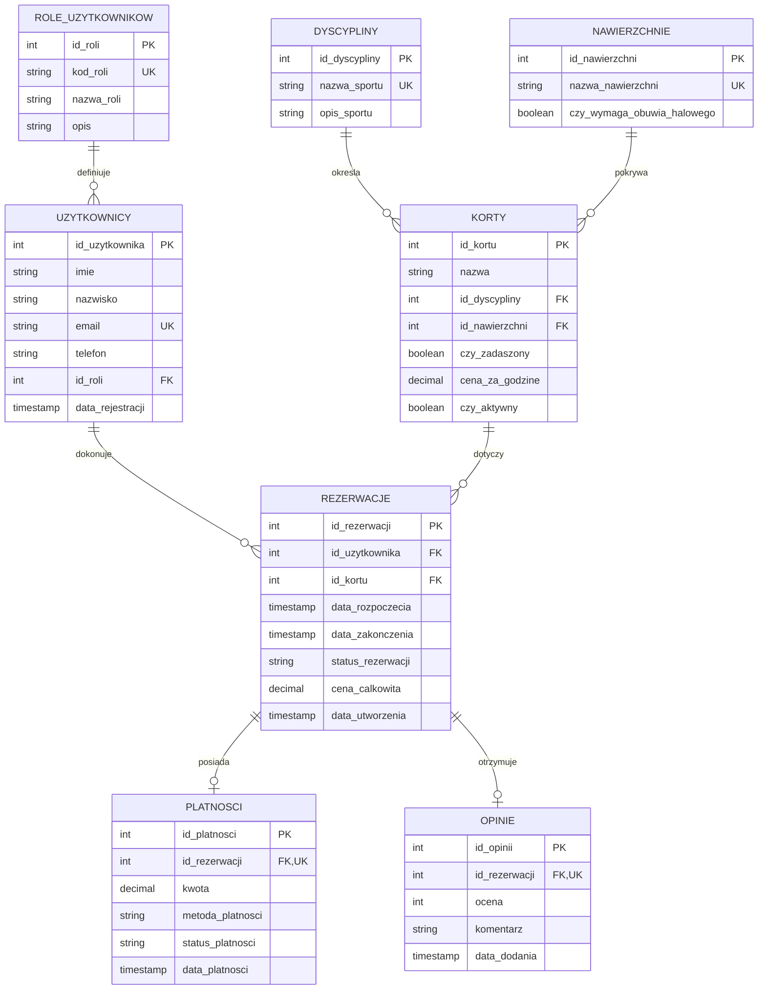

# Projekt Bazy Danych - System Rezerwacji Kortów Sportowych

Niniejszy dokument przedstawia opis struktury bazodanowej, wymagania funkcjonalne, model konceptualny, normalizację do postaci 3NF, mechanizmy transakcyjne oraz szczegóły bezpieczeństwa (role, uprawnienia i Row-Level Security).

---

## 1. Analiza Wymagań (Wymagania Funkcjonalne)

Baza danych wspiera działanie systemu rezerwacji kortów sportowych w następującym zakresie:
- **Zarządzanie użytkownikami**: Rejestracja klientów, pracowników obsługi oraz administratorów. Każdy użytkownik ma przypisaną jedną rolę, która definiuje jego uprawnienia.
- **Katalog obiektów (kortów)**: Ewidencja dostępnych kortów wraz z określeniem ich przeznaczenia (tenis, squash, badminton itp.), typu nawierzchni (mączka, trawa syntetyczna, parkiet), statusu zadaszenia (hala czy kort otwarty) oraz stawki godzinowej.
- **Rezerwacje**: Klienci mogą rezerwować wybrane korty w określonych godzinach. System musi uniemożliwić zarezerwowanie tego samego kortu przez dwóch użytkowników w nakładających się terminach.
- **Płatności**: Każda rezerwacja generuje płatność. Płatność może być realizowana różnymi metodami (BLIK, karta, przelew, gotówka) i posiadać różne statusy (oczekująca, zrealizowana, odrzucona).
- **System ocen**: Po zrealizowaniu rezerwacji klient ma możliwość wystawienia oceny (od 1 do 5) wraz z komentarzem tekstowym.
- **Raportowanie i Analiza**: Baza danych dostarcza gotowe widoki do analizy przychodów, obłożenia kortów oraz aktywności klientów.

---

## 2. Model Relacyjny i Normalizacja do 3NF (Trzecia Postać Normalna)

W celu wyeliminowania redundancji danych, anomalii modyfikacji oraz zapewnienia pełnej spójności, struktura bazy została w pełni znormalizowana do **3NF**.

### Przejście do 3NF (Wydzielenie słowników):
W pierwotnej wersji niektóre atrybuty tekstowe mogły powodować redundantne zapisy i zależności tranzytywne. Wprowadzono słowniki bazodanowe:
1.  **Tabela `role_uzytkownikow`**: Wydzielenie ról użytkowników ze struktury tabeli `uzytkownicy`. Wcześniej kolumna `rola` była polem tekstowym z ograniczeniem CHECK. Wydzielenie jej do osobnej tabeli pozwala na elastyczne dodawanie nowych ról oraz wiązanie z nimi szczegółowych praw dostępu, eliminując zależność tranzytywną (rola -> uprawnienia/opisy).
2.  **Tabela `dyscypliny`**: Wydzielenie dyscyplin sportowych z tabeli `korty`. Zapobiega to powtarzaniu opisów sportów w rekordach poszczególnych kortów i porządkuje strukturę danych.
3.  **Tabela `nawierzchnie`**: Wydzielenie typów nawierzchni z tabeli `korty`. Pozwala to na przechowywanie cech specyficznych dla nawierzchni (np. wymóg obuwia halowego) w jednym miejscu, zamiast powtarzania tych flag przy każdym korcie.

```
[Przed normalizacją (Zależność tranzytywna)]:
id_kortu -> nazwa, typ_sportu, typ_nawierzchni, czy_wymaga_obuwia_halowego
(gdzie typ_nawierzchni określa czy_wymaga_obuwia_halowego - anomalie 3NF!)

[Po normalizacji do 3NF]:
id_kortu -> nazwa, id_dyscypliny, id_nawierzchni
id_nawierzchni -> nazwa_nawierzchni, czy_wymaga_obuwia_halowego
```

---

## 3. Diagram Związków Encji (ERD)

Poniższy diagram przedstawia związki między encjami w docelowej strukturze 3NF:



---

## 4. Transakcje i Concurrency Control (Poziomy Izolacji)

Aby zapobiec problemom współbieżności, takim jak **podwójna rezerwacja** (ang. *double booking* lub *write skew*), w projekcie wdrożono i udokumentowano dwa podejścia transakcyjne:

### 1. Blokowanie Pesymistyczne (`SELECT ... FOR UPDATE`)
*   **Poziom izolacji**: `READ COMMITTED` (domyślny w PostgreSQL).
*   **Zasada działania**: Podczas sprawdzania dostępności kortu blokujemy odpowiadający mu wiersz w tabeli `korty` za pomocą klauzuli `FOR UPDATE`. Każda inna transakcja próbująca odczytać ten sam wiersz w tym samym trybie zostaje wstrzymana do czasu zakończenia naszej transakcji (`COMMIT` lub `ROLLBACK`). Dzięki temu zapytanie sprawdzające dostępność zwraca zawsze spójne dane, chroniąc przed wyścigiem.

### 2. Izolacja Szeregowalna (`SERIALIZABLE`)
*   **Poziom izolacji**: `SERIALIZABLE` (najwyższy poziom).
*   **Zasada działania**: Transakcje wykonują się optymistycznie bez blokowania. Jeżeli silnik bazy danych (PostgreSQL SSI - *Serializable Snapshot Isolation*) wykryje, że współbieżne zatwierdzenie transakcji naruszy spójność logiczną (powstanie konflikt odczytu/zapisu), transakcja próbująca zatwierdzić dane jako druga zostanie wycofana z błędem izolacji (`40001: serialization_failure`). Aplikacja kliencka musi w takim przypadku przechwycić ten błąd i ponowić próbę.

---

## 5. Bezpieczeństwo Danych (Role, Uprawnienia i RLS)

Bezpieczeństwo na poziomie bazy danych zostało wdrożone za pomocą ról, uprawnień obiektowych (DCL) oraz polityk bezpieczeństwa wierszy (**Row-Level Security - RLS**).

### 5.1. Role bazodanowe i Uprawnienia (DCL)
-   `rola_klient`:
    -   Odczyt (`SELECT`) z tabel słownikowych oraz katalogu kortów: `korty`, `dyscypliny`, `nawierzchnie`, `opinie`.
    -   Zapis i modyfikacja własnych rezerwacji i płatności: `SELECT, INSERT, UPDATE` na tabelach `rezerwacje` i `platnosci`.
    -   Dodawanie opinii do zakończonych transakcji: `INSERT` na tabeli `opinie`.
-   `rola_pracownik`:
    -   Pełne uprawnienia operacyjne do zarządzania wszystkimi rekordami: `SELECT, INSERT, UPDATE, DELETE` na tabelach `uzytkownicy`, `korty`, `rezerwacje`, `platnosci`, `opinie`, `dyscypliny`, `nawierzchnie`.
-   `rola_admin`:
    -   Pełne uprawnienia administratora (`ALL PRIVILEGES`) włącznie z możliwością modyfikacji struktur DDL.

### 5.2. Row-Level Security (RLS)
RLS pozwala ograniczyć widoczność rekordów w tej samej tabeli w zależności od tego, kto wykonuje zapytanie.
Dla tabel `rezerwacje` i `platnosci` włączono RLS i zdefiniowano polityki:
-   **Polityka dla rezerwacji** (`policy_rezerwacje_klient`):
    ```sql
    USING (id_uzytkownika = (SELECT id_uzytkownika FROM uzytkownicy WHERE email = current_setting('app.biezacy_email_uzytkownika', true)))
    ```
    Klient podpięty pod rolę `rola_klient` widzi wyłącznie te wiersze w tabeli `rezerwacje`, dla których jego email (przechowywany w parametrze sesji `app.biezacy_email_uzytkownika`) odpowiada polu `email` w tabeli `uzytkownicy`. Próba odczytu lub zapisu rekordu z innym `id_uzytkownika` jest odrzucana przez bazę danych.
-   **Polityka dla płatności** (`policy_platnosci_klient`):
    Filtruje płatności tak, by pokazać tylko te przypisane do rezerwacji należących do aktualnego klienta.
